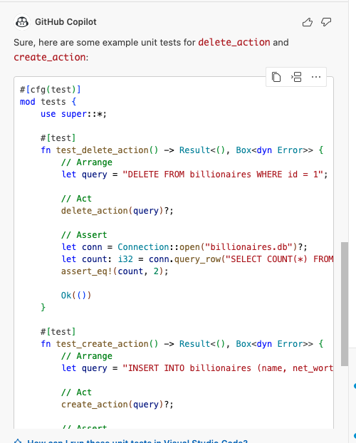
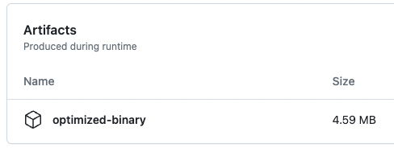

# RUST CLI Binary with SQLite

[](https://github.com/nogibjj/IDS706_Individual_Project2_KM632/actions/workflows/rust.yml)

## Project Overview

This project is a Rust-based command-line tool that enables users to perform CRUD (Create, Read, Update, Delete) operations on an SQLite database. The tool includes robust error-handling, linting, formatting, and testing features  

## Video Demo 

## Installation

* Clone the repository

```bash
git clone git@github.com:nogibjj/IDS706_Individual_Project2_KM632.git
cd IDS706_Individual_Project2_KM632
```
* Build the Project

```bash 
make release 
```
This will create an optimized binary in the target/release/sqlite_rust

## Usage / CRUD Demonstration

First, build the SQLite database. Command below takes the "world_billionaires.csv" file and add them to a database called "billionares" in a table called "world_billionaires". If the table already, exists, table is dropped and recreated. 

```bash 
make etl
```
Next, you can perform any of the CRUD operations. In the Makefile, I already listed some CRUD operations you can run easily. Otherwise, you can also run your own queies (shown below!)

### Create
To run the example Create operation, you can run

```bash
make create
```
This will run the following query: 
```sql 
INSERT INTO world_billionaires (rank, final_worth, category, person_name, age, country, city, source, self_made, gender, last_name, first_name) VALUES (1, 211000, 'Technology', 'Haliunaa Munkhuu', 28, 'United States', 'Durham', 'Noogle', TRUE, 'F', 'Haliunaa', 'Munkhuu');
```
If you would like to run your custom query, run 

```bash 
command run create "your sql query"
```

### Read
To run the example Read operation, you can run

```bash
make read
```
This will run the following query: 
```sql 
SELECT * FROM world_billionaires WHERE category = 'Technology' AND age > 90;
```
If you would like to run your custom query, run 

```bash 
cargo run read "your sql query"
```

### Update
To run the example Update operation, you can run

```bash
make update
```
This will run the following query: 
```sql 
UPDATE world_billionaires SET final_worth = 300000 WHERE person_name = 'Mark Zuckerberg';
```
If you would like to run your custom query, run 

```bash 
cargo run update "your sql query"
```

### Delete 
To run the example Delete operation, you can run

```bash
make delete
```
This will run the following query: 
```sql 
DELETE FROM world_billionaires WHERE person_name = 'Elon Musk';
```
If you would like to run your custom query, run 

```bash 
cargo run delete "your sql query"
```

## Use of Github Copilot

I incorporated Github Copilot in the following ways: 

* I let Copilot write me unit test function 

* Used "Explain this" to understanding compile errors

* Used the chat to refine this Readme document! 



## Error Handling

In this project, I make extensive use of Rust's '?' error propagation feature. All recoverable errors are propagated up to the main.rs file, where they are printed to the terminal and the program exits gracefully.

## Optimized Rust Binary

Optimized Rust binary is in Actions. Go to the latest worklow and scroll all the way down to see the downloan link. 



## References

https://github.com/nogibjj/Jeremy_Tan_IDS706_Week8_Individual
https://github.com/nogibjj/IDSProject2Conterno